## ble_heart_rate_profile Tera Term Script

This application demonstrates the "Heart Rate Measurement" functionality in Heart Rate Profile using the RS9116W(NCP) module with UART and USB-CDC ports. RS9116W module will work as a Heart rate sensor. By enabling the notification in the remote device whenever the value is updated it will notify the Remote device.

Before continuing, ensure the RS9116 EVK is plugged into your computer and TeraTerm is connected as described in [Getting Started with PC using AT Commands](http://docs.silabs.com/rs9116-wiseconnect/2.4/wifibt-wc-getting-started-with-pc/). 

**STEP 1.** Reset the RS9116 EVK.

**STEP 2.** In the Tera Term menu select `Control->Macro`.

	
**STEP 3.** Navigate to the folder `./RS9116W.x.x.x.xx/examples/at_commands/teraterm` which contains the example scripts and select the file `ble_heart_rate_profile.ttl`.

**STEP 4.** After running ble_heart_rate_profile.ttl script, it will pop up as shown.

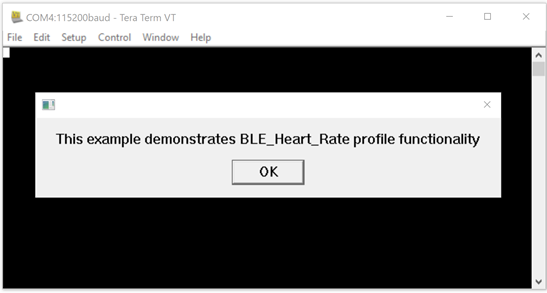

**STEP 5.** Initially, the ABRD process will run and you will see a pop-up as “Firmware Loading Done “

 	
**STEP 6.** Command sequence will execute one by one, now the device is in advertising state.

**STEP 7.**  When you scan through the Remote BT device, it will see the scan results. Once you initiate the connection, it will connect and will fetch the remote device “MTU” and “LE Data length update.”
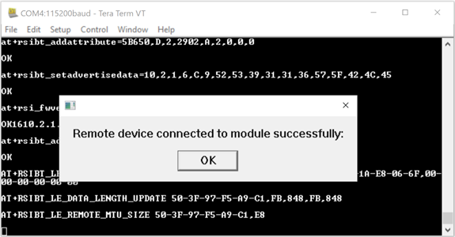

**STEP 8.** After successful connection script will ask for “Enable Notification.”

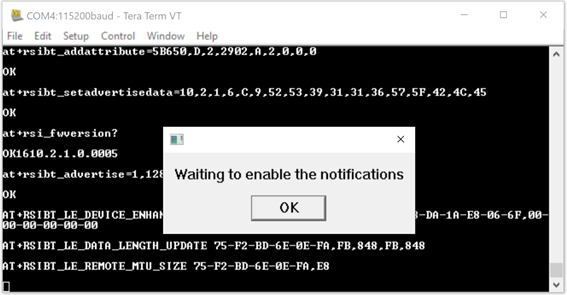

**STEP 9.** After enabling the Notification in the Remote device, RS9116 will send data notifications for 10 times to the Remote device and then ask for disabling the notifications.

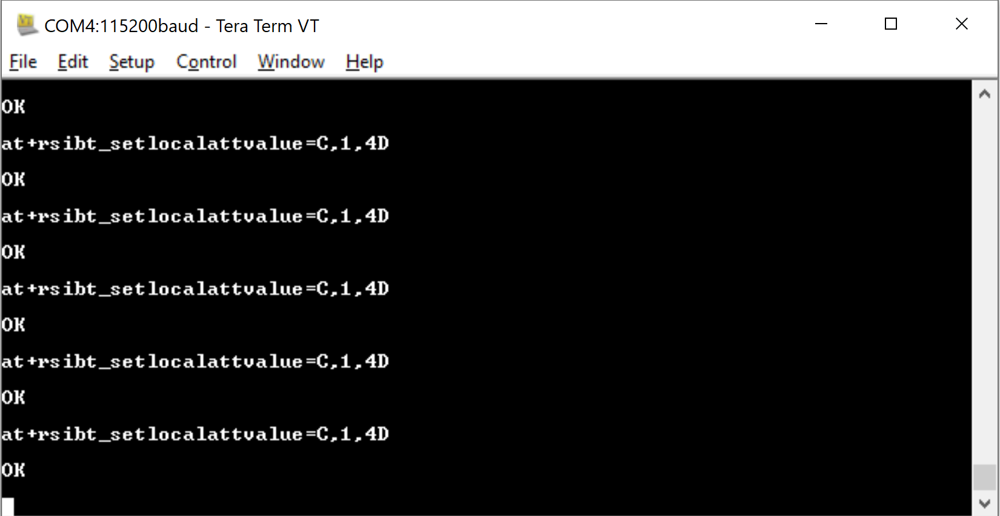

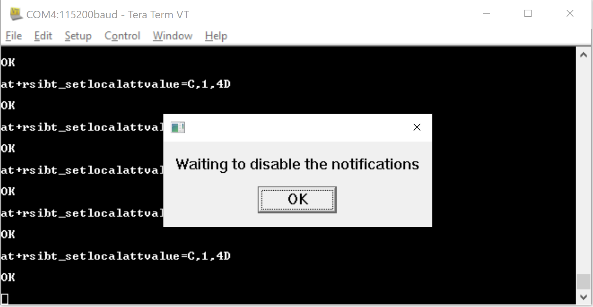

**STEP 10.** After disabling the notifications in the script as well as in Remote Device, again it will ask to enable the notifications. Once we press the “Enable Notification” Please enable the Remote device also.

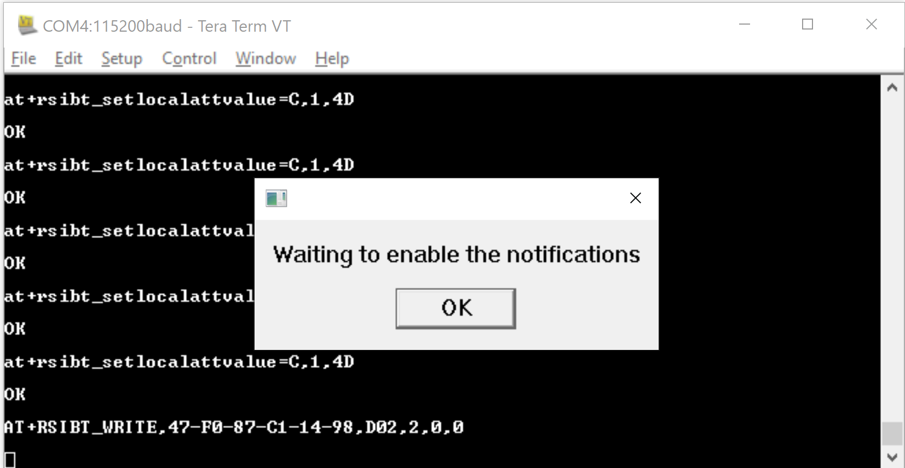

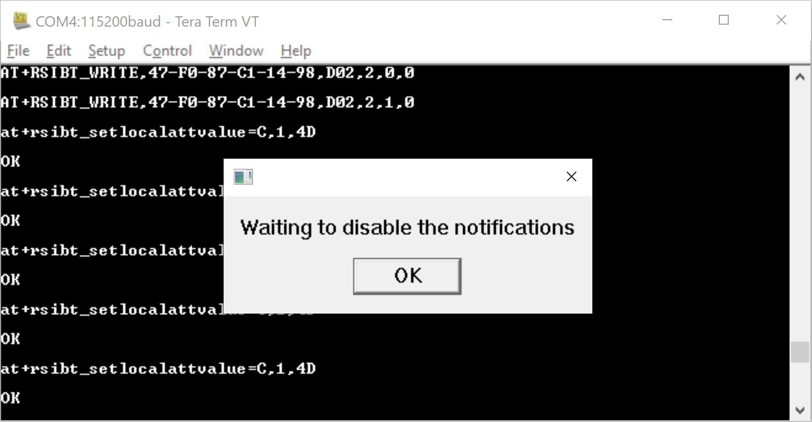

**STEP 11.** After 10 notifications sent to the remote device, it will again ask to disable and once, we disable the notification, it will again ask to enable the notification.

**STEP 12.** This process repeats, after enabling the notifications in the script along with the Remote device, 10 notifications send to the Remote Device. After 10 notifications send to the remote device, script will ask to disable the notifications parallelly in the remote device also. 

## Connection Using the Remote Device

We can connect using the “EFR Connect” app on the mobile.

**STEP 13.**  Open the “EFR Connect” app on the mobile (Remote Device) and scan for the devices. Below you can see the advertisers list.

 
**STEP 14.**  All the advertising devices list we can be able to see in the scanning list. Once we get the required Advertiser, we can directly give the connection initiation to the RS9116 and make sure the connection should be successful. 

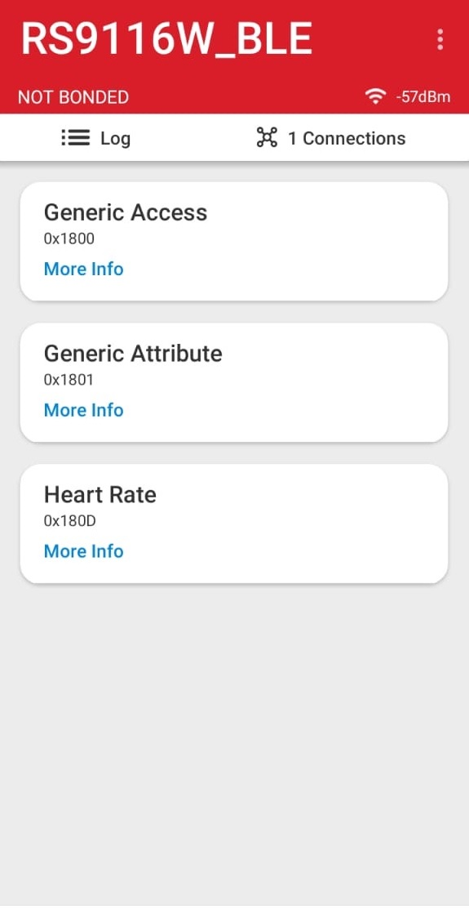

**STEP 15.**  Now we can see the “RS9116” Heart rate monitor service “0x180d” in the service list. By clicking on that service, we can see the respective attribute and properties.

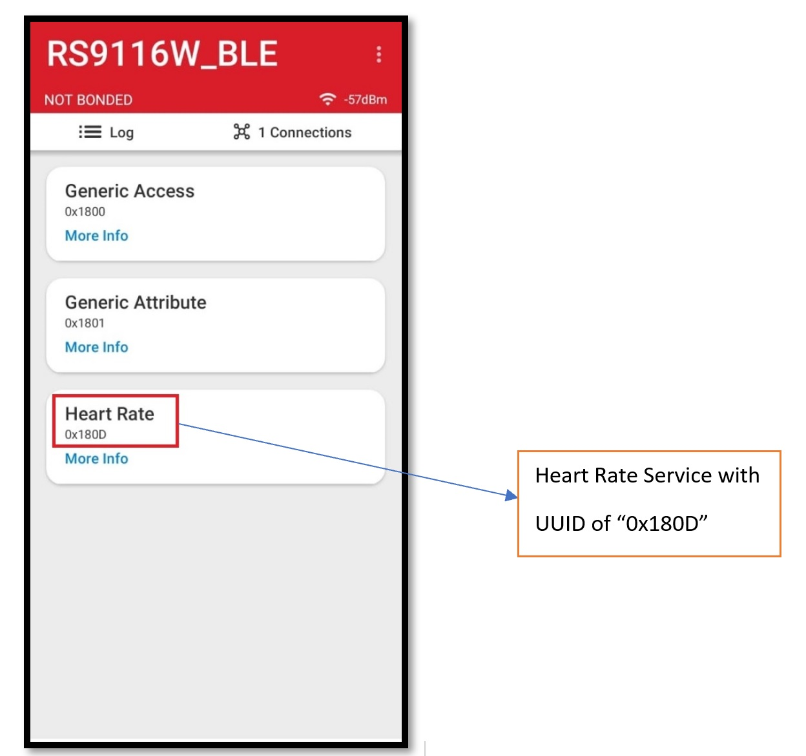

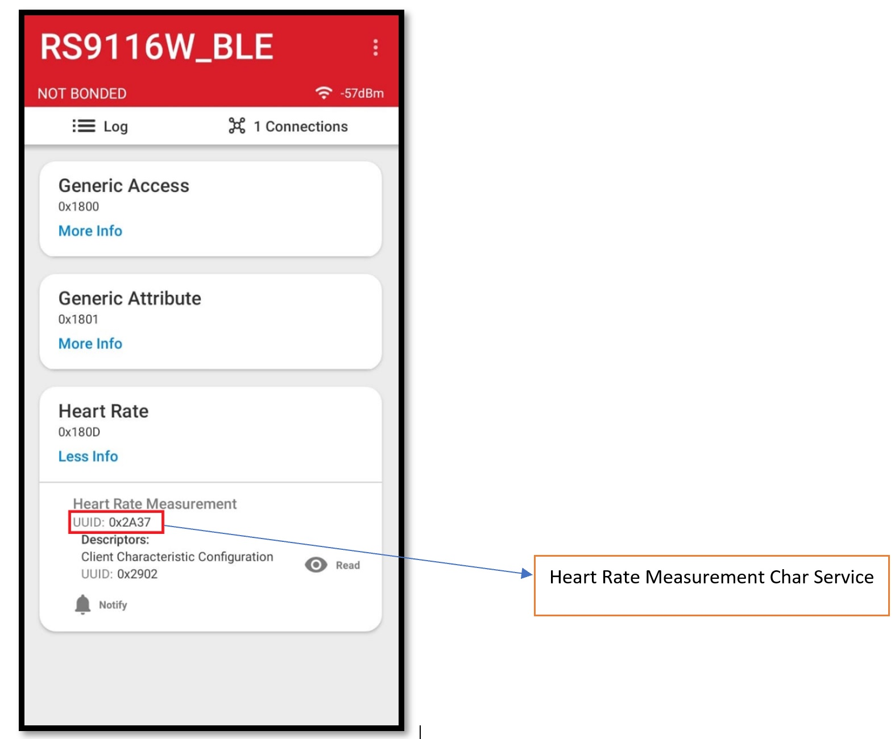

**STEP 16.**  After connection, the "Tera-term" script will ask for the "Enable Notification", when you enable the notification in the Remote device, the RS9116 device will send the "Heart Rate" value.

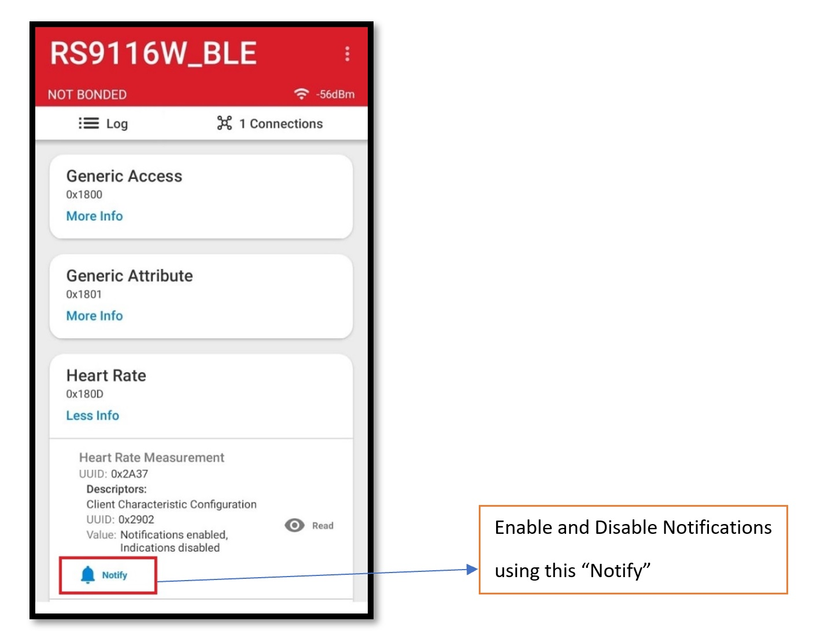

