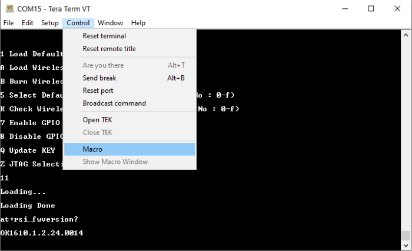
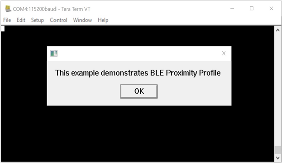
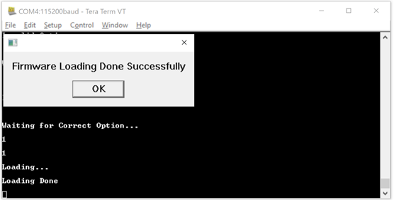
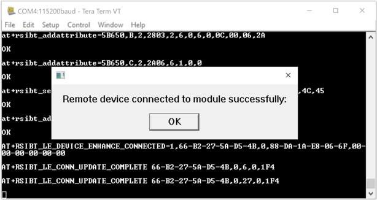
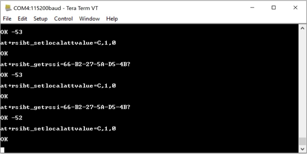
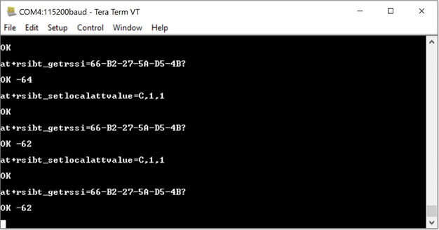
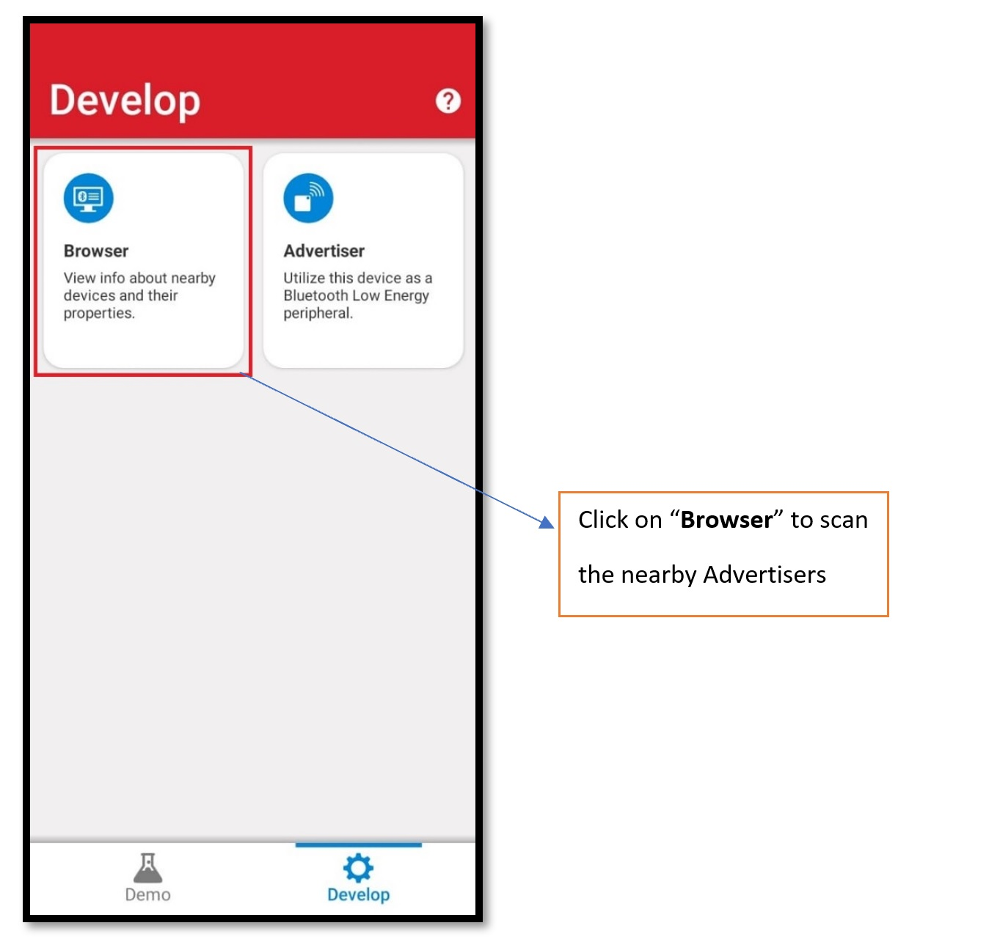
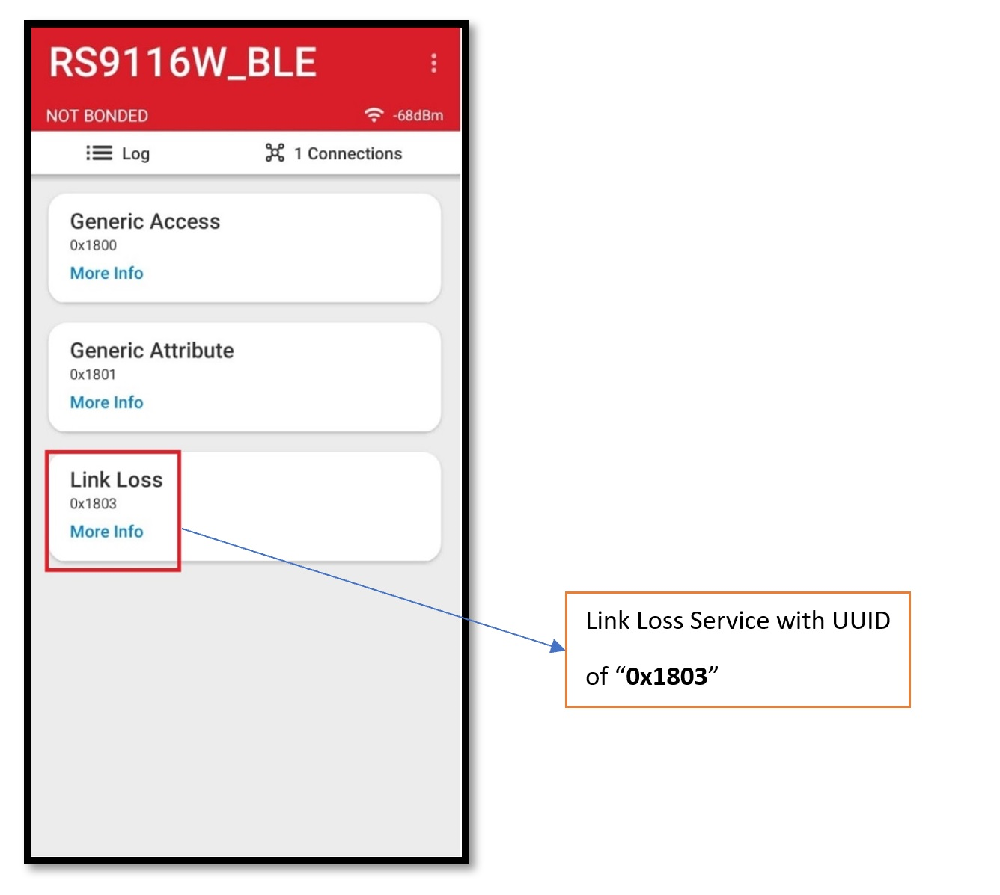
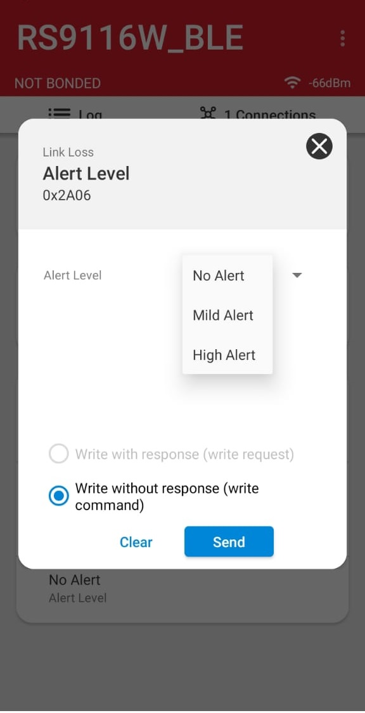
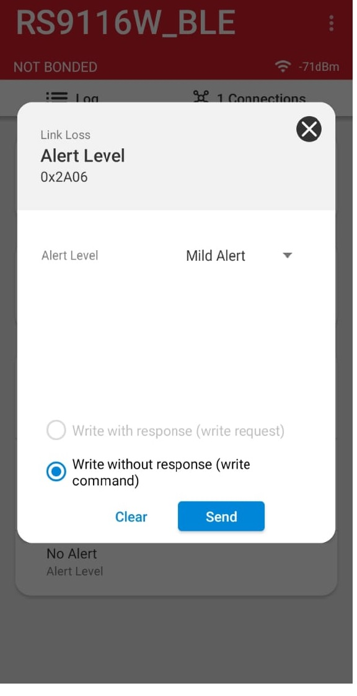

## ble_proximity_profile Tera Term Script

This application demonstrates how to prepare BLE Profiles with AT Commands and see the functionality of "Proximity Reporter" using the RS9116W(NCP) EVK with UART and USB-CDC ports. RS9116W module will work as a Proximity Reporter, whenever the remote device moves away from the "Proximity Reporter (RS9116W)" it will indicate the alarm with selected  "Alert Level".

Before continuing, ensure the RS9116 EVK is plugged into your computer and TeraTerm is connected as described in [Getting Started with PC using AT Commands](http://docs.silabs.com/rs9116-wiseconnect/2.4/wifibt-wc-getting-started-with-pc/). 

**STEP 1.** Reset the RS9116 EVK.

**STEP 2.** In the Tera Term menu select `Control->Macro`.

	
**STEP 3.** Navigate to the folder `./RS9116W.x.x.x.xx/examples/at_commands/teraterm` which contains the example scripts and select the file `ble_proximity_profile.ttl`.

**STEP 4.** After running the “Proximity_Profile.ttl” script, it will pop up as shown.

**STEP 5.** Initially, the ABRD process will run, and you will see a pop-up as “Firmware Loading Done“.

 	
**STEP 6.** Command sequence will execute one by one, now the device is in advertising state.

**STEP 7.**  When you scan through the Remote BT device, it will show the scan results. Once you initiate the connection, it will connect.

**STEP 8.** After successful connection script will ask for selection of “Alert Level” for Indication.

**STEP 9.**  Once select the “Alert Level” in the Remote device, the write event comes here. In Remote Device when you click the “Write_without_Response” property it will show 3 Alert Levels. 1. No Alert 2. Mild Alert 3. High Alert.

**STEP 10.** After selecting the “Alert Level”, the script will continuously run in a loop. Based on the RSSI of the Remote Device, Proximity Reporter (RS9116) will indicate the mentioned Alert level to the Remote device. This can check in the remote devices using the “Read” property.

Note: - Threshold mentioned in the application script is -85dbm

**STEP 11.** Here RSSI is “-52”, which is less than “threshold” So when you read in the Remote device on the “Alert Level” characteristic it will show the value as “0x00” means “No Alert”.

**STEP 12.** Here RSSI is “-62”, which is more than “threshold” So when you read in the Remote device on the “Alert Level” characteristic it will show the value as “0x01” means “Mild Alert”.

## Connection Using the Remote Device

We can connect using the “EFR Connect” app on the mobile.

**STEP 13.**  Open the “EFR Connect” app on the mobile (Remote Device) and scan for the devices. Below you can see the advertisers list.

**STEP 14.**  All the advertising devices list we can be able to see in the scanning list. Once we get the required Advertiser, we can directly give the connection initiation to the RS9116 and make sure the connection should be successful. 

**STEP 15.**  After successful connection script will ask to select the “Alert Level” for the indication purpose. By selecting the Alert Level, it will pop up on the tera term.

Note: - Threshold mentioned in the application script is -85dbm

**STEP 16.**  Here we selected the “Mild Alert”, So it is updated on the script and updated value on the same characteristic.

**STEP 17.**  After selection of the “Alert Level” from the “Remote device (Mobile)” script will run continuously, then whenever the RSSI does not cross the threshold level it will have “Alert Level” as “No Alert” we can see using the “Read” Property.

**STEP 18.**  Wherever the RSSI crosses the threshold level it will have “Alert Level” as “Mild  Alert” we can see using the “Read” Property.

