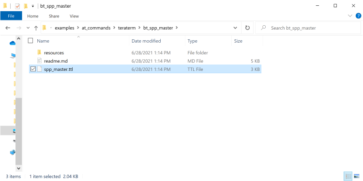
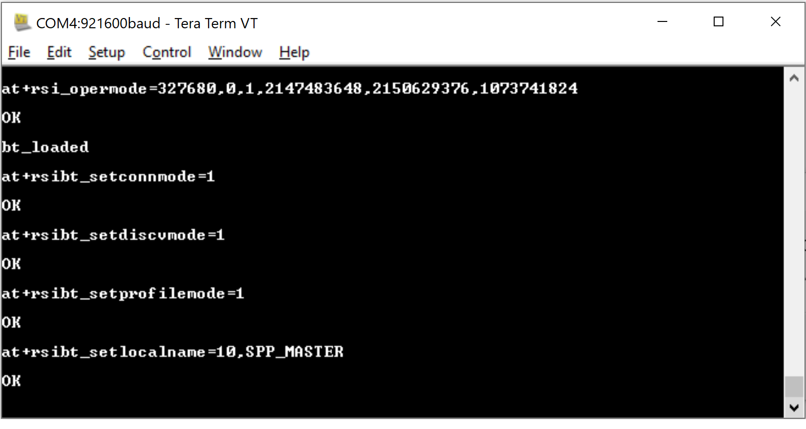
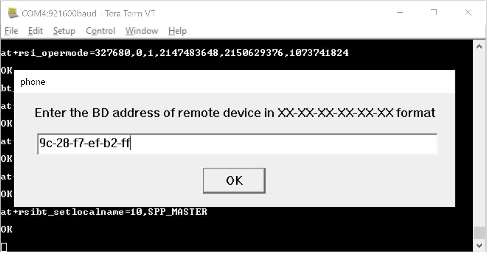
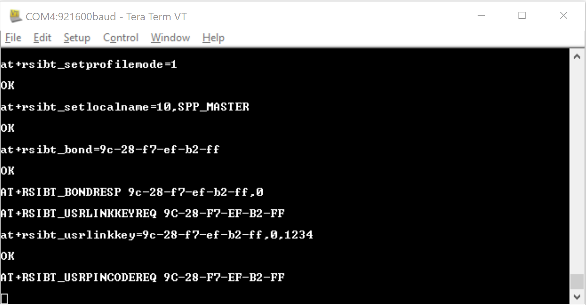
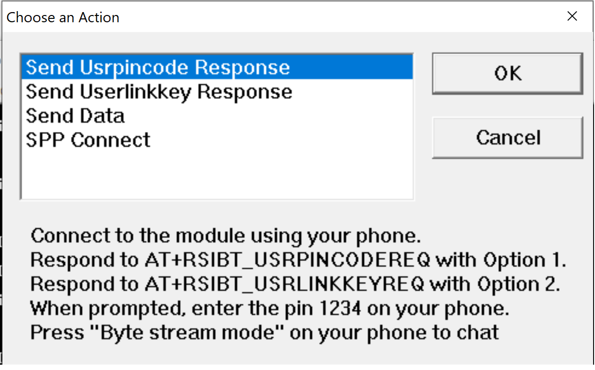
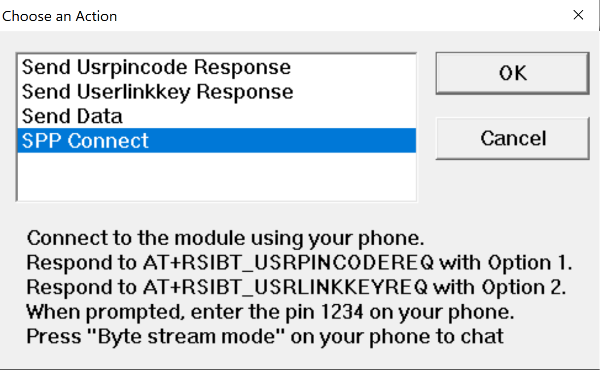
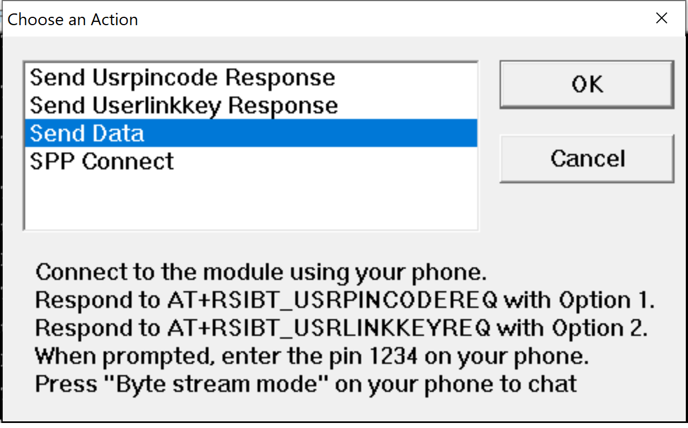
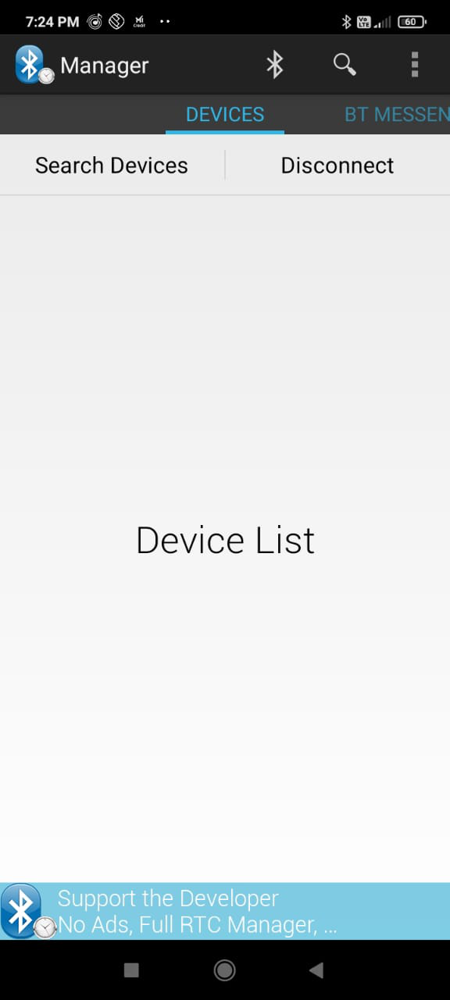

## BT SPP Master Tera Term Script

This example demonstrates how to configure the RS9116W Module in BT SPP Master mode and establish an SPP profile connection with a remote device. Once connected data can be exchanged between two BT devices over SPP.

Note: To run this script user required "Bluetooth SPP Manager" application with Android phone for data transfer.
Before continuing, ensure the RS9116 EVK is plugged into the PC and TeraTerm is connected as described in 

[Getting Started with PC using AT Commands](http://docs.silabs.com/rs9116-wiseconnect/2.4/wifibt-wc-getting-started-with-pc/). 

**STEP 1.** Reset the RS9116 EVK.

**STEP 2.** In the Tera Term menu select `Control->Macro`.

	
**STEP 3.** Navigate to the folder `<SDK>/examples/at_commands/teraterm/bt_spp_master`  and select the file `spp_master.ttl`.

**STEP 4.** At startup the module gets configured with below Command sequence:

1. Opermode

2. Set connectable mode

3. Set discoverable mode

4. Set profile mode

5. Set local name

Configuration of the mobile device as spp_slave please refer the "Bluetooth SPP Manager" setting procedure.

 
  
 	
**STEP 5.** After these commands are successful, the remote slave device needs to be in connectable mode. And once it will be in connectable mode, the user needs to give bond command. For this BD address of the remote device needs to be entered here.

Note :- Address should be in following format "AA-BB-CC-DD-EE-FF".

Note: 
The Mobile BD address can be checked 

`Settings ->About phone ->All spec ->Status -> Bluetooth address`

Other mobiles this may vary
`Settings ->About phone ->status -> Bluetooth address`

**STEP 6.** Now host will get a bond response as well as the "link key" req event in the terminal screen. User needs to give a response to the module immediately (i.e. if on terminal bond response)

and for the "userlinkkey" request "userlinkkey response" need to give immediately).

after that "user pincode" request event come user needs to click send "user pincode" response immediately

Same to be entered on Mobile App side

 After this event remote slave device is paired. Again give the "spp connect" command and the host will get the 
`AT+RSIBT_SPPCONNECTED` event.

**STEP 7.** `AT+RSIBT_SPPCONNECTED` event means SPP level connection is successful. Now both devices can communicate using selecting option 3 "Send Data".

   Observe the data in the terminal of the App.

Note: The command sequence for the SPP profile connection is as below.

**TX RX Events** 

| TX Events                                    |   | RX Events                                |
| -------------------------------------------- | - | ---------------------------------------- |
|                                              | ← |  AT+RSIBT_USRLINKKEYREQ C0-EE-FB-DA-49-7C|
| at+rsibt_usrlinkkey=C0-EE-FB-DA-49-7C,0,1234 | → |                                          |
|                                              | ← | AT+RSIBT_USRPINCODEREQ C0-EE-FB-DA-49-7C |
| at+rsibt_usrpincode=C0-EE-FB-DA-49-7C,1,1234 | → |                                          |
|                                              | ← | AT+RSIBT_USRLINKKEYSAVE C0-EE-FB-DA-49-7C,B2,6C,91,49,D7,27,60,82,68,2,78,2,60,78,F8,AE |
|                                              | ← | AT+RSIBT_AUTHENTICATION_STATUS C0-EE-FB-DA-49-7C,1 |
| at+rsibt_sppconn=C0-EE-FB-DA-49-7C           | → |                                          |
|                                              | ← | AT+RSIBT_SPPCONNECTED C0-EE-FB-DA-49-7C  |
| at+rsibt_spptx=5,HELLO                       | → |                                          |
|                                              | ← | AT+RSIBT_SPPRX 1,1                       |

## Bluetooth SPP Manager Bluetooth Terminal App setting procedure

**STEP 1.** Turn on the bluetooth and Open the `Bluetooth SPP Manager` app in your Android phone.
 
**STEP 2.** Click on the table option which is shown at the right hand side top corner of the app as shown in below image

 

**STEP 3.** Click on the "Set Device Discoverable" option shown in the menu, when "bond response" event received on the module side ASAP. Now, the mobile in discoverable mode for that particular time. In the below image timeout is mentioned as 60s. The mobile is in discoverable mode upto 60S.

 
 
 
 
**STEP 4.** After successful connection with the RS9116 BT_SPP_Master and Remote mobile device, we can able see the data transfer.

 
 
 
 
